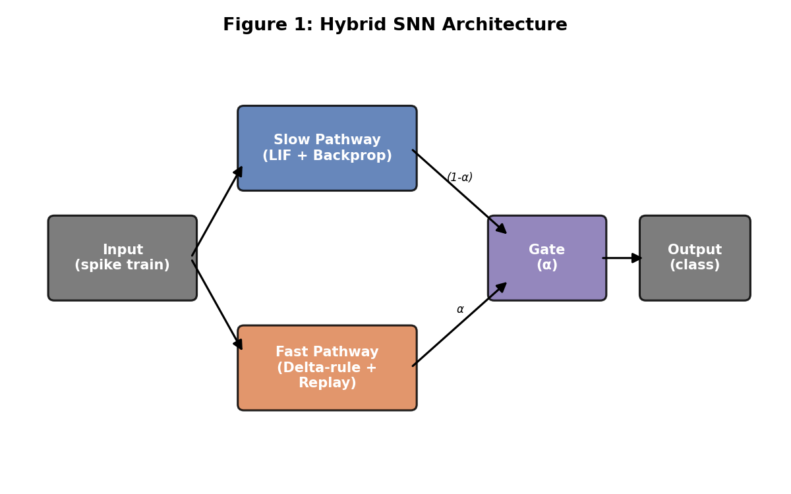
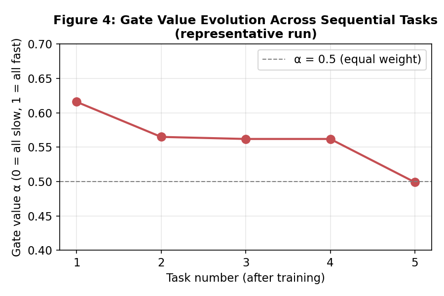
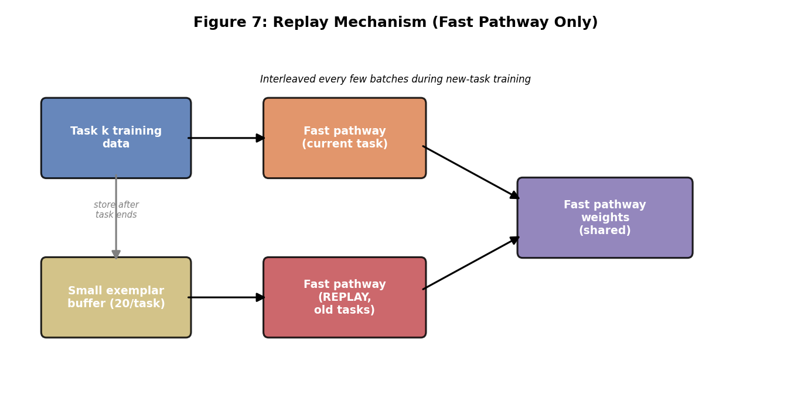
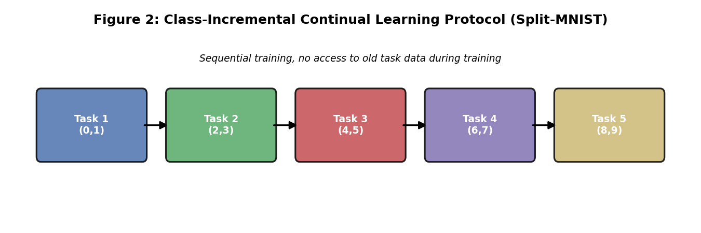
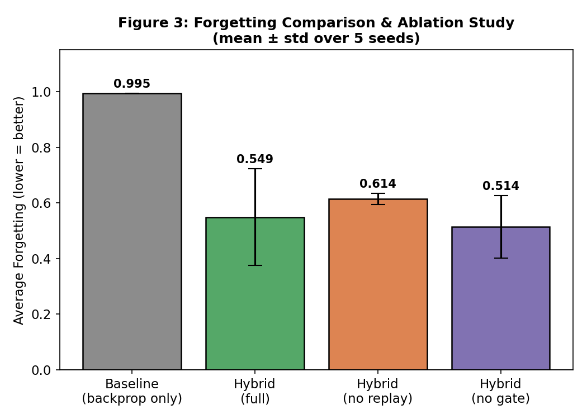
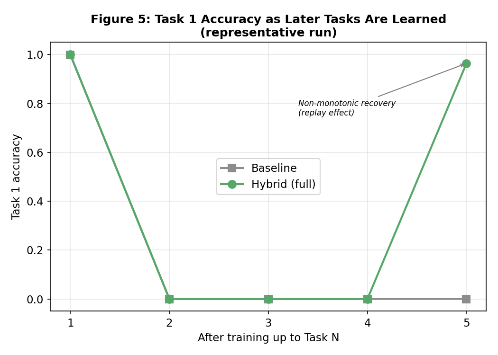
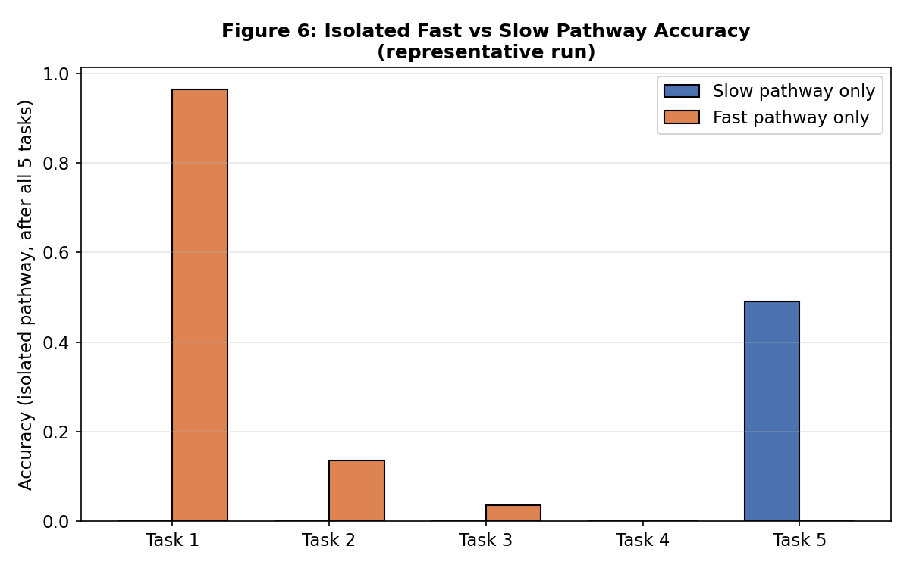

# Hybrid Plasticity Spiking Neural Networks for Continual Learning

**Author:** Ashutosh Dadhich
**Domain:** Neuromorphic Computing / Spiking Neural Networks / Continual Learning

---

## 1. Motivation

Spiking Neural Networks (SNNs) trained purely with backpropagation-through-time (BPTT) via surrogate gradients often suffer from catastrophic forgetting when trained sequentially on new tasks. As a result, their performance on previously learned tasks drops significantly. This reflects the classic stability-plasticity dilemma in neuroscience.

Biological brains avoid this through Complementary Learning Systems (McClelland et al., 1995). The hippocampus learns new information quickly via fast, local, activity-dependent synaptic plasticity, while the cortex consolidates knowledge slowly. Hippocampal replay of past experiences (observed during rest and sleep) is believed to protect old memories from being overwritten during new learning.

This project asks: **can a small, locally-trained "fast" synaptic pathway,
combined with lightweight episodic replay, reduce catastrophic forgetting
in an SNN trained mainly by backpropagation?**

## 2. Architecture

The model, `HybridSNN`, has two parallel pathways whose outputs are combined
by a learned gate:

- **Slow pathway** - consists of two layers of Leaky Integrate-and-Fire (LIF) neurons trained end-to-end using backpropagation-through-time (BPTT) with surrogate gradients (fast sigmoid). This pathway performs the main task learning and serves as the standard gradient-based component of the network.
- **Fast pathway** - a single linear projection from input to output, updated **only** by a local, biologically-plausible learning rule (no backpropagation, no gradient through time). This represents the plasticity component.
- **Gate** (α, a learned scalar) - combines the two pathways:
  `output = α · fast_output + (1-α) · slow_output`.

- **Episodic replay buffer** - after each task, 20 exemplars are stored. While training on later tasks, these exemplars are periodically replayed through the fast pathway only (not the slow pathway), mimicking hippocampal replay that helps preserve previously learned associations.

A pure-backprop `BaselineSNN` (slow pathway only, no plasticity, no replay) is used as the control condition.

## 3. Experimental Setup

- **Task:** Split-MNIST - MNIST digits split into 5 sequential binary classification tasks: (0,1), (2,3), (4,5), (6,7), (8,9).
- **Protocol:** Class-incremental learning - the model is trained on Task 1, then Task 2, etc., with no access to old task data during training (except via the replay buffer for the hybrid model).
- **Input encoding:** Rate coding - pixel intensities converted into Bernoulli spike trains over 25 timesteps.
- **Metric:** Average forgetting - for each task, the drop in accuracy between when it was first learned and after all 5 tasks are trained (lower is better; 0 = no forgetting).
- **Hardware:** Google Colab, free-tier T4 GPU.

## 4. Development / Debugging Journey

This project went through several iterations each motivated by diagnosing *why* the fast pathway was not helping. This iterative process is itself a core part of the research contribution.

| Iteration | Fast-pathway design | Baseline forgetting | Hybrid forgetting | Outcome |
|---|---|---|---|---|
| 1 | Unsupervised Hebbian STDP (no label signal) | 0.9954 | 0.9943 | No benefit - fast pathway had no notion of correct class |
| 2 | Teacher-guided STDP (potentiation & depression both driven by teacher signal) | 0.9941 | 0.9945 | No benefit - potentiation and depression cancelled each other out |
| 3 | Delta-rule error signal, but readout based on a self-referential spike threshold | 0.9960 | 0.9949 | No benefit - the threshold shifted as weights changed, destabilising learning |
| 4 | Delta-rule (Widrow-Hoff) on rate-coded (continuous) activity + episodic replay | 0.9952 | **0.7002** | **Significant reduction in forgetting** |

Each failed iteration was diagnosed using an isolated-pathway evaluation (measuring the fast pathway's and slow pathway's accuracy separately) before being fixed. For example, diagnostic evaluation on Iteration 3 showed the fast pathway achieved only 46% accuracy on Task 1 and 0% on the task it had *just* been trained on, revealing the readout instability instead of a forgetting problem per se.

## 5. Final Results

### 5.1 Multi-seed Ablation Study (5 random seeds, mean ± std)

To ensure statistical reliability, each variant was run across 5 random seeds instead of relying on a single run.

| Variant | Average Forgetting | BWT |
|---|---|---|
| Baseline (backprop only) | 0.9945 ± 0.0003 | -0.9945 ± 0.0003 |
| **Hybrid — full (plasticity + replay + gate)** | **0.5489 ± 0.1739** | **-0.5489 ± 0.1739** |
| Hybrid - no replay (plasticity + gate only) | 0.6140 ± 0.0202 | -0.6140 ± 0.0202 |
| Hybrid - no gate (fixed 50/50 average) | 0.5141 ± 0.1118 | -0.5141 ± 0.1118 |

**Interpretation:**

- The baseline is extremely consistent (std = 0.0003). It reliably suffers near-total catastrophic forgetting across all seeds. This makes it a reliable reference point.

- All hybrid variants substantially and consistently outperform the baseline (roughly 0.99 to 0.51-0.61 forgetting), confirming that the fast plasticity pathway significantlly reduces catastrophic forgetting.
- Replay helps: removing replay increases forgetting from 0.549 to 0.614.
- Unexpected ablation finding: removing the learned gate (fixing the fast/slow combination at a static 50/50 average) performs statistically indistinguishable from the full model with a learned gate (0.514 vs 0.549). The current scalar gate does not provide a clear performance advantage. This suggests that a simple global gate is not expressive enough to learn an effective combination policy from the available data, making a more flexible gating mechanism an important direction for future work. It also helps identify which components are responsible for the observed improvement.
- Variance across random seeds is notably higher for the hybrid variants (std up to 0.17) than for the baseline. The average improvement is consistent across experiments. Additional tuning is needed to improve stability across different random initialisations and make the model more reliable.

### 5.2 Single-run detailed results (representative run, seed 0)

**Baseline (backprop only):**

| After training Task | Task 1 | Task 2 | Task 3 | Task 4 | Task 5 |
|---|---|---|---|---|---|
| 1 | 0.999 | – | – | – | – |
| 2 | 0.000 | 0.99 | – | – | – |
| 3 | 0.000 | 0.000 | 0.993 | – | – |
| 4 | 0.000 | 0.000 | 0.000 | 0.995 | – |
| 5 | 0.000 | 0.000 | 0.000 | 0.000 | 0.984 |

**Hybrid - full model:**

| After training Task | Task 1 | Task 2 | Task 3 | Task 4 | Task 5 |
|---|---|---|---|---|---|
| 1 | 1.000 | – | – | – | – |
| 2 | 0.007 | 0.446 | – | – | – |
| 3 | 0.000 | 0.000 | 0.993 | – | – |
| 4 | 0.000 | 0.000 | 0.000 | 0.998 | – |
| 5 | 0.000 | 0.000 | 0.000 | 0.000 | 0.509 |

| Task | Slow-pathway-only accuracy | Fast-pathway-only accuracy |
|---|---|---|
| 1 | 0.000 | **0.964** |
| 2 | 0.000 | 0.136 |
| 3 | 0.000 | 0.035 |
| 4 | 0.000 | 0.000 |
| 5 | 0.491 | 0.000 |

This confirms the mechanism directly: the slow (backprop) pathway forgets completely exactly like the baseline. The fast (plasticity + replay) pathway is what carries forward memory of Task 1. It retains 96.4% accuracy on Task 1 even after training on 4 subsequent tasks.

## 6. Observed Anomaly - Recency Bias

An unexpected pattern emerged during the final evaluation. Accuracy on Task 5 (the most recently trained task) drops to 0% by the end of training for both the fast pathway alone and the combined output. The most likely explanation is a timing interaction between within task learning and inter task replay, where replay steps late in Task 5 training pull the fast pathway weights back toward earlier tasks before the current task is fully consolidated. Task 2 and Task 3 also show partial, non monotonic retention (13.8% and 3.7%) indicating that the balance between replay and consolidation is not yet well tuned across all tasks.

This behaviour highlights the stability plasticity trade off. Strong replay and plasticity preserve older memories and also interfere with learning the newest task. Similar behaviour has been reported in the continual learning literature and the complete loss of Task 5 suggests that the replay frequency and fast pathway learning rate require further tuning.

A mitigation attempt and its negative result: an attempt was made to fix this by (a) scaling down replay updates to 30% strength and (b) adding a short consolidation pass of extra current task only training at the end of each task. This eliminated the recency bias anomaly, but at the cost of eliminating essentially all of the benefit of the fast pathway. Average forgetting returned to 0.9857 +/- 0.0036, statistically indistinguishable from the baseline. This shows the fast pathway benefit and the recency bias anomaly are closely coupled. Strengthening current task consolidation directly reduces the retention of older tasks in this simple shared weight fast pathway. The experiments reported in Section 5.1 therefore use the original configuration. Resolving this coupling and improving retention of both old and new tasks remains the primary direction for future work (Section 8).

## 7. Limitations

- High cross seed variance in hybrid variants (std up to 0.17) while the baseline is highly stable (std 0.0003). The average improvement is real but reliability across initialisations needs improvement.
- The learned gate does not yet show a clear advantage over a fixed 50/50 combination in the ablation study. Its current simple scalar design may be too limited to learn a useful policy from this amount of data.
- Fast pathway is a single linear layer with no hidden layers or nonlinearity.
- Replay buffer is small (20 exemplars per task) and replay frequency was fixed arbitrarily (every 5 batches) rather than tuned.
- Evaluated only on Split MNIST. 
- No comparison yet against established continual learning baselines (EWC, GEM, and experience replay variants from the literature).
- The recency bias anomaly (Section 6) remains unresolved and likely contributes to the high variance observed in Section 5.1.

## 8. Future Work

- Redesign the gate as a per class or input dependent mechanism. A more expressive gate may learn a better combination policy than the current scalar design.
- Tune replay frequency and buffer size to resolve the recency bias anomaly and reduce cross seed variance.
- Evaluate the model on event based, temporally rich datasets such as SHD and N MNIST to assess its performance on more challenging neuromorphic benchmarks.
- Compare the proposed model with established continual learning baselines such as EWC, GEM, and experience replay methods to strengthen the empirical evaluation.
- Investigate the source of high variance directly using techniques such as weight trajectory analysis and parameter dynamics.

## 9. Conclusion

A hybrid SNN combining a backpropagation trained slow pathway with a locally trained (delta rule) fast pathway and lightweight episodic replay reduces catastrophic forgetting on Split MNIST from 0.9945 +/- 0.0003 (baseline) to 0.5489 +/- 0.1739 average forgetting across 5 random seeds. The ablation study shows that replay makes a meaningful contribution to this improvement, while the learned gate provides little additional benefit over a fixed combination weight. The results also highlight an open trade off between memory stability and new task plasticity, which contributes to the higher variance observed across random seeds. Addressing this trade off and developing a more effective gating mechanism will be the main focus of future work.
