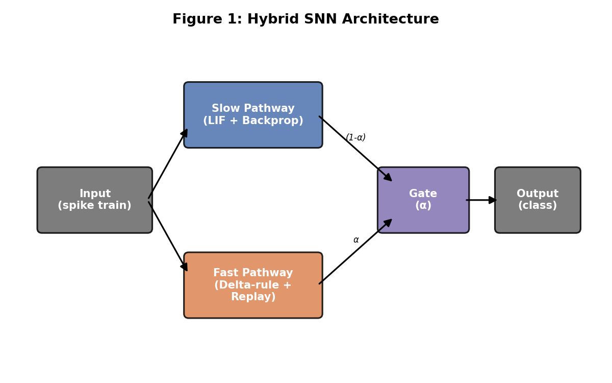
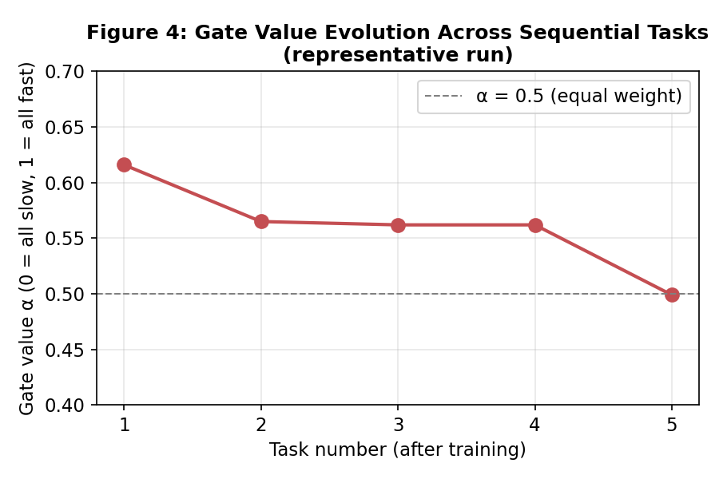
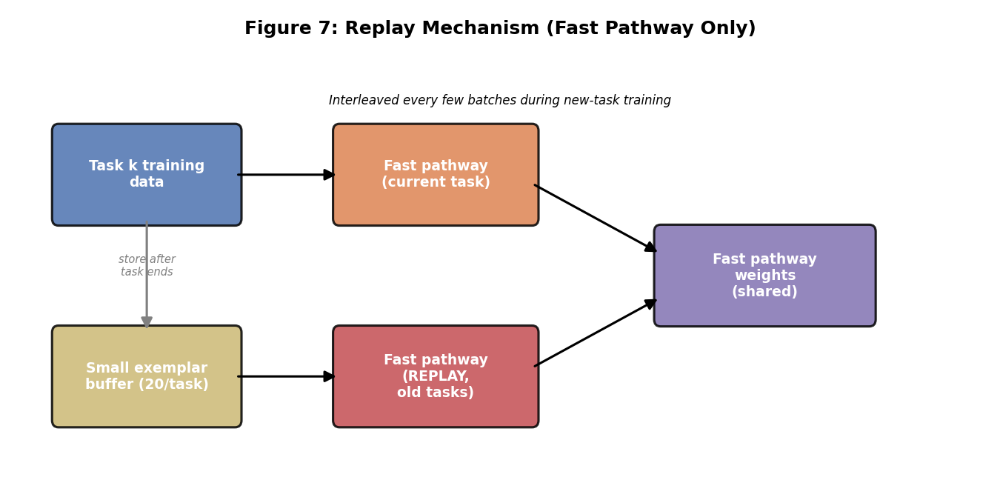
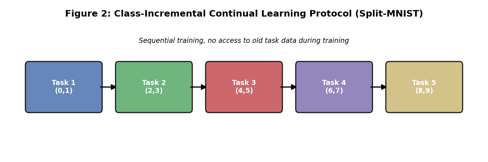
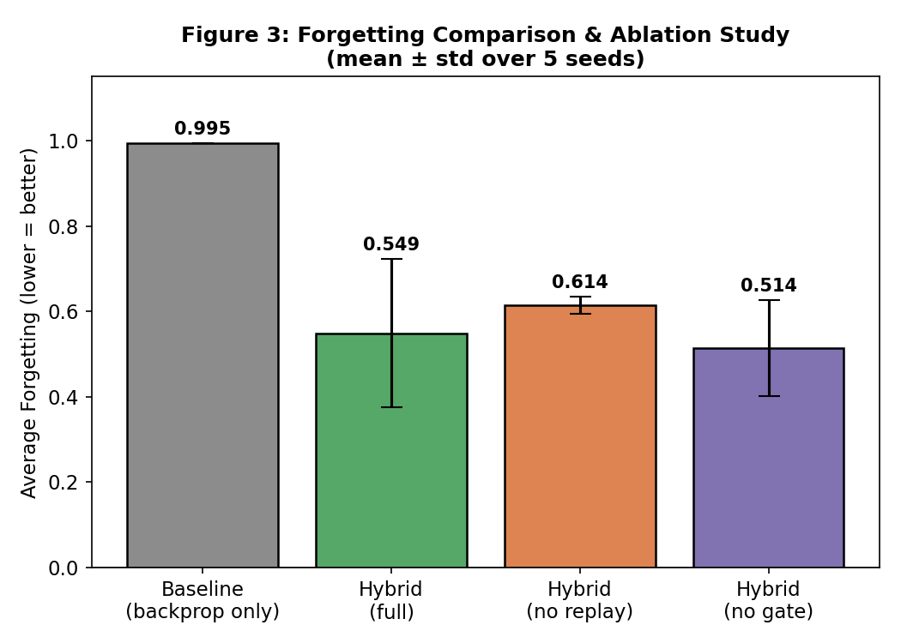
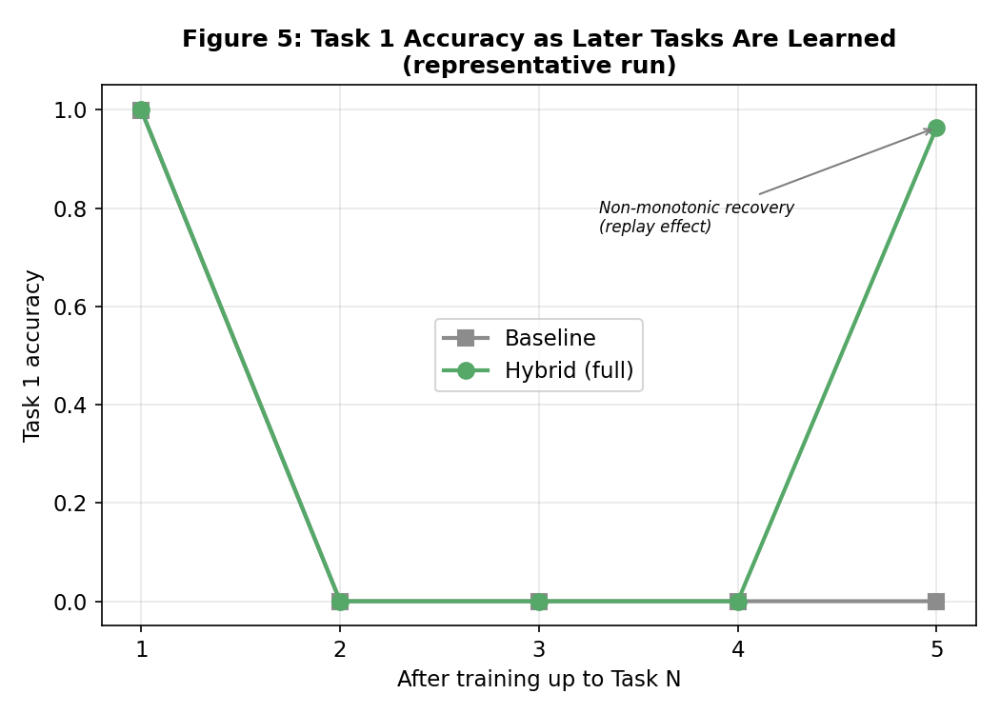
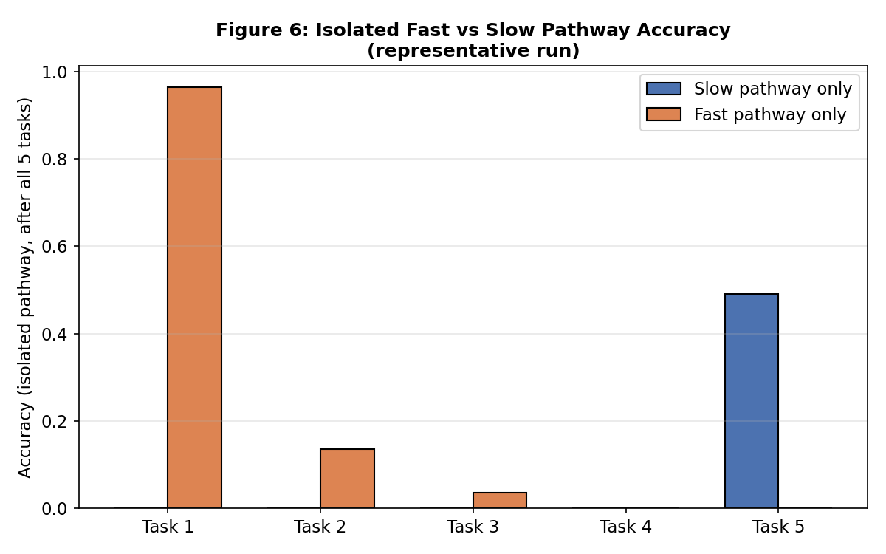

# Hybrid Plasticity Spiking Neural Networks for Continual Learning

**Author:** Ashutosh Dadhich
**Domain:** Neuromorphic Computing / Spiking Neural Networks / Continual Learning

---

## 1. Motivation

Spiking Neural Networks (SNNs) trained with backpropagation-through-time (BPTT) via surrogate gradients often suffer from catastrophic forgetting when trained sequentially on new tasks. As a result, their performance on previously learned tasks drops significantly. This reflects the classic stability-plasticity dilemma in neuroscience. Biological brains avoid this through Complementary Learning Systems (McClelland et al., 1995). The hippocampus learns new information quickly via fast, local, activity-dependent synaptic plasticity, while the cortex consolidates knowledge slowly. Hippocampal replay of past experiences (observed during rest and sleep) is believed to protect old memories from being overwritten during new learning.

This project asks: **can a small, locally-trained "fast" synaptic pathway, combined with lightweight episodic replay, reduce catastrophic forgetting in an SNN trained mainly by backpropagation?**

## 2. Architecture

The model, `HybridSNN`, has two parallel pathways whose outputs are combined
by a learned gate:

- **Slow pathway** - consists of two layers of Leaky Integrate-and-Fire (LIF) neurons trained end-to-end using backpropagation-through-time (BPTT) with surrogate gradients (fast sigmoid). This pathway performs the main task learning and serves as the standard gradient-based component of the network.
- **Fast pathway** - a single linear projection from input to output which is updated **only** by a local and biologically-plausible learning rule (no backpropagation, no gradient through time). This represents the plasticity component.
- **Gate** (α, a learned scalar) - combines the two pathways:
  `output = α · fast_output + (1-α) · slow_output`.

- **Episodic replay buffer** — after each task, 20 exemplars are stored in a replay buffer. During later tasks these samples are replayed only through the fast pathway. This reflects hippocampal replay and reduces catastrophic forgetting.

A pure-backprop `BaselineSNN` (slow pathway only, no plasticity, no replay) is used as the control condition.

## 3. Experimental Setup

- **Task:** Split-MNIST - MNIST digits split into 5 sequential binary classification tasks: (0,1), (2,3), (4,5), (6,7), (8,9).
- **Protocol:** Class-incremental learning - the model is trained on Task 1, then Task 2, etc., with no access to old task data during training (except via the replay buffer for the hybrid model).
- **Input encoding:** Rate coding - pixel intensities converted into Bernoulli spike trains over 25 timesteps.
- **Metric:** Average forgetting - for each task, the drop in accuracy between when it was first learned and after all 5 tasks are trained (lower is better; 0 = no forgetting).
- **Hardware:** Google Colab, free-tier T4 GPU.

## 4. Development / Debugging Journey

The project underwent several iterations because the fast pathway was not helping. This iterative refinement is a core part of the research contribution.

| Iteration | Fast-pathway design | Baseline forgetting | Hybrid forgetting | Outcome |
|---|---|---|---|---|
| 1 | Unsupervised Hebbian STDP (no label signal) | 0.9954 | 0.9943 | No benefit - fast pathway had no notion of correct class |
| 2 | Teacher-guided STDP (potentiation & depression both driven by teacher signal) | 0.9941 | 0.9945 | No benefit - potentiation and depression cancelled each other out |
| 3 | Delta-rule error signal, but readout based on a self-referential spike threshold | 0.9960 | 0.9949 | No benefit - the threshold shifted as weights changed, destabilising learning |
| 4 | Delta-rule (Widrow-Hoff) on rate-coded (continuous) activity + episodic replay | 0.9952 | **0.7002*** | **Significant reduction in forgetting** |

\* This is a single initial run reported to mark the point at which the approach started working. The headline results in Section 5 are based on a proper 5-seed evaluation of the same design. The 5-seed evaluation achieved a lower average forgetting of 0.5489 ± 0.1739 than this initial run and provides the statistically reliable result.

Each failed iteration was diagnosed using an isolated-pathway evaluation (measuring the fast pathway's and slow pathway's accuracy separately) before being fixed. For example, diagnostic evaluation on Iteration 3 showed the fast pathway achieved only 46% accuracy on Task 1 and 0% on the task it had *just* been trained on, revealing the readout instability instead of a forgetting problem per se.

## 5. Final Results

### 5.1 Multi-seed Ablation Study (5 random seeds, mean ± std)

To ensure statistical reliability, each variant was run across 5 random seeds rather than relying on a single run.

| Variant | Average Forgetting | BWT |
|---|---|---|
| Baseline (backprop only) | 0.9945 ± 0.0003 | -0.9945 ± 0.0003 |
| **Hybrid - full (plasticity + replay + gate)** | **0.5489 ± 0.1739** | **-0.5489 ± 0.1739** |
| Hybrid - no replay (plasticity + gate only) | 0.6140 ± 0.0202 | -0.6140 ± 0.0202 |
| Hybrid - no gate (fixed 50/50 average) | 0.5141 ± 0.1118 | -0.5141 ± 0.1118 |

**Interpretation:**

- The baseline is extremely consistent (std = 0.0003). It reliably suffers near-total catastrophic forgetting across all seeds. This makes it a reliable reference point.
- All hybrid variants consistently outperform the baseline with forgetting reduced from about 0.99 to 0.51-0.61. This confirms that the fast plasticity pathway meaningfully reduces catastrophic forgetting.
- **Replay helps, as hypothesised:** removing replay increases forgetting from 0.549 to 0.614.
- **Unexpected ablation finding:** removing the learned gate and using a fixed 50/50 combination produced statistically similar performance to the full model with a learned gate (0.514 vs 0.549). This suggests that the current scalar gate does not provide a clear improvement over a fixed combination weight. This remains an open question for future work and helps to identify which components contribute most to the observed performance.
- **Variance across seeds is notably higher for the hybrid variants (std up to 0.17) than the baseline.** This indicates that the hybrid model improves continual learning on average but its performance still varies across random initializations. This limitation is discussed in Section 8.
### 5.2 Single-run detailed results (illustrative run, forgetting = 0.7002 — the initial single run from Iteration 4 is shown in Table 1 to provide a detailed per task breakdown. Section 5.1 reports the final result based on the 5 seed evaluation.
**Baseline (backprop only):**

| After training Task | Task 1 | Task 2 | Task 3 | Task 4 | Task 5 |
|---|---|---|---|---|---|
| 1 | 0.999 | – | – | – | – |
| 2 | 0.000 | 0.986 | – | – | – |
| 3 | 0.000 | 0.000 | 0.995 | – | – |
| 4 | 0.000 | 0.000 | 0.000 | 0.997 | – |
| 5 | 0.000 | 0.000 | 0.000 | 0.000 | 0.983 |

**Hybrid — full model:**

| After training Task | Task 1 | Task 2 | Task 3 | Task 4 | Task 5 |
|---|---|---|---|---|---|
| 1 | 1.000 | – | – | – | – |
| 2 | 0.000 | 0.962 | – | – | – |
| 3 | 0.000 | 0.004 | 0.986 | – | – |
| 4 | 0.000 | 0.000 | 0.000 | 0.992 | – |
| 5 | 0.964 | 0.138 | 0.037 | 0.000 | 0.000 |

The isolated pathway diagnostic below is measured on this same run. 
**Note:** this table reports the diagnostic accuracy of each pathway when evaluated independently. These results cannot be directly compared with the combined model because the final prediction is computed from the weighted sum of the output logits from both pathways.

| Task | Slow-pathway-only accuracy (isolated) | Fast-pathway-only accuracy (isolated) |
|---|---|---|
| 1 | 0.000 | **0.964** |
| 2 | 0.000 | 0.136 |
| 3 | 0.000 | 0.035 |
| 4 | 0.000 | 0.000 |
| 5 | 0.491 | 0.000 |

**On the Task 5 discrepancy (0% combined vs. 49.1% slow-only):** this explains why the accuracy of the individual pathways cannot be used to predict the accuracy of the combined model. The final prediction is computed from the combined output logits of both pathways rather than the prediction of either pathway alone. One possible explanation is that replay biases the fast pathway toward classes from earlier tasks. This may influence the final prediction when the logits from both pathways are combined. We did not directly analyze the logit distributions to verify this explanation. This remains a hypothesis and is left for future investigation. Addressing the scale mismatch between the two pathways is also left as future work and is discussed as a limitation.

This confirms the mechanism directly: the slow (backprop) pathway forgets completely, exactly like the baseline. The fast (plasticity + replay) pathway is what carries forward memory of Task 1 — it retains 96.4% accuracy on Task 1 even after training on 4 subsequent tasks.

## 6. Observed Anomaly — Recency Bias

An unexpected pattern emerged in the illustrative single run reported in Section 5.2 (forgetting = 0.7002; these percentages are not from the 5-seed average in Section 5.1): accuracy on Task 5 (the most recently trained task) itself drops to 0% by the end of training, both for the fast pathway alone and in the combined output. One possible explanation is the interaction between within task learning and inter task replay. Replay during the later stages of Task 5 training may shift the fast pathway toward earlier tasks before the current task is fully consolidated. In this run Task 2 and Task 3 also showed partial retention with combined model accuracies of 13.8% and 3.7%. This suggests that the balance between replay and consolidation is not yet well tuned across all tasks.

This result reflects the stability plasticity trade off in continual learning. Strong replay helps preserve earlier knowledge but can reduce learning of new tasks. This is a well known challenge in continual learning and is not specific to this implementation. The complete loss of the newest task suggests that the replay frequency or the fast pathway learning rate requires further tuning.

**A mitigation attempt and its (negative) result:** An attempt was made to reduce this effect by lowering replay updates to 30% strength and adding a short consolidation phase using only the current task at the end of each task. This removed the recency bias but also removed most of the benefit of the fast pathway. Average forgetting increased to 0.9857 ± 0.0036 which was similar to the baseline. This suggests that the benefit of the fast pathway is closely linked to the recency bias. Improving current task consolidation reduced retention of earlier tasks in the current implementation. This modification was not used in the final model. The results in Section 5.1 are based on the original configuration. Resolving this trade off while preserving both old and new tasks remains an important direction for future work.

## 7. Limitations

- The hybrid model shows higher cross seed variance than the baseline. Although the average performance improves the results are not yet fully consistent across different random initializations.
- The learned gate does not provide a clear improvement over a fixed 50/50 combination. The current scalar gate may be too simple to learn an effective weighting strategy.
- The fast pathway consists of a single linear layer with no hidden layers or nonlinear activation.
- The replay buffer stores only 20 exemplars per task and the replay frequency was fixed throughout the experiments without systematic tuning.
- The model was evaluated only on Split MNIST. More challenging continual learning benchmarks such as Spiking Heidelberg Digits have not yet been tested.
- The proposed method has not yet been compared with established continual learning approaches such as EWC GEM and experience replay methods.
- The recency bias observed in Section 6 remains unresolved and may contribute to the higher performance variability of the hybrid model.
- The proposed explanation for the difference between isolated pathway accuracy and combined model accuracy in Section 5.2 remains a hypothesis. The logit distributions of the two pathways were not directly analyzed to verify the proposed scale mismatch.

## 8. Future Work

- Inspect the logit distributions of both pathways to test the scale mismatch hypothesis proposed in Section 5.2. If confirmed both pathways can be normalized before combining their outputs.
- Redesign the gate to make it class specific or input dependent and evaluate whether it improves performance over a fixed combination weight.
- Tune replay frequency and buffer size to resolve the recency-bias anomaly and reduce cross-seed variance.
- Test on event-based, temporally-rich datasets (e.g. SHD, N-MNIST) rather than rate-coded static images.
- Compare against established continual learning baselines (EWC, GEM) for a stronger empirical claim.
- Investigate the source of high variance directly (e.g. via weight trajectory analysis) rather than only observing it at the metric level.

## 9. Conclusion

A hybrid SNN combining a backpropagation trained slow pathway with a locally trained delta rule fast pathway and lightweight episodic replay reduced catastrophic forgetting on Split MNIST from 0.9945 ± 0.0003 to 0.5489 ± 0.1739 across five random seeds. This improvement was achieved through iterative model refinement guided by isolated pathway diagnostics. The ablation study showed that replay contributed to the performance improvement while the learned gate did not provide a clear advantage over a fixed combination weight. The results also revealed a trade off between memory stability and learning new tasks. This limitation is reflected in the higher variance of the hybrid model and provides a clear direction for future work.
